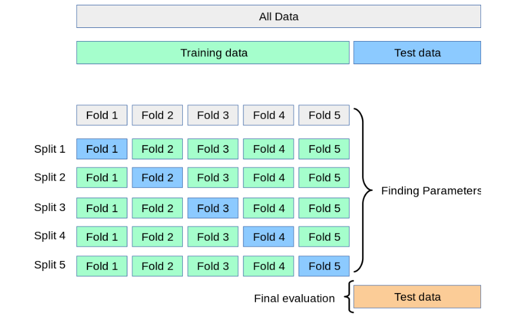

# Lecture 2 Machine Learning
## Measuring performance of a model

- MAE
- MSE
- $R^2$-score

### Note: 
$R^2$ In simpler terms, it tells us how well the chosen independent variable(s) explain the variation in the dependent variable. Put even more simply, R-squared is a measure of how well your data fits a line or curve.

An R^2 value of 1 means that all the variation in the dependent variable can be explained by the independent variable(s), while a value of 0 means there is no linear relationship between the variables.

## Complexity
The bias variance tradeoff.
### Bias
The bias is the difference between the average prediction of our model and the correct value which we are trying to predict. Models with high bias pays little attention to the training data and oversimplifies the model. It always leads to high error on training and test data.

### Variance
Variance is the variability of model prediction for a given data point or a value which tells us spread of our data. Model with high variance pays a lot of attention to training data and does not generalize on the data which it hasn’t seen before. As a result, such models perform very well on training data but has high error rates on test data.

## Cross Validation
### N-fold cross validation

## Hyperparameter tuning
### Grid Search

A hyperparameter is a parameter whose value is set before the training process begins and affects how the model is trained, such as learning rate or the number of hidden layers in a neural network.

## Normalization
Scales component to reduce variation. Helps optimizers and is fundamental in some ML models (e.g. SVM and KNN, i.e. distance based models)

## Ridge regression
$$\min_\beta \left | Xw - y \right |_2^2 + \alpha \left | \beta \right |_2^2$$

## Lasso regression
$$ \min_\beta  \left | Xw - y \right |_2^2 + \alpha \left | \beta \right |_1
$$

## Elastic net
$$\min_\beta  \left | Xw - y \right |_2^2 + \gamma \left | \beta \right |_1 + \frac{1}{2} \alpha \left | \beta \right |_2^2
$$

## Kernel trick
Is alternative to using nonlinear basis functions (NBF). It becomes more efficient than using NBF if the number of bases approaches infinity. 

### Kernel Ridge Regression
$$\boldsymbol{\beta} = \left( \boldsymbol{\Phi(X)}^\top \boldsymbol{\Phi(X)} + \alpha \text{Idim}(\boldsymbol{\phi}(\textbf{X}_i)) \right)^{-1} \boldsymbol{\Phi(X)}^\top \textbf{Y}$$

#### Solution: 
Observe: the solution consists only of inner products. If we come up with a mapping for these products we have solved the problem (see Mercer's Theorem)

Just have to come up with a **kernel function**.
The reason is that the kernel function $k(\vec{X_i}, \vec{X_j})$ implicitly defines the inner product of the transformed feature space without explicitly transforming the original vectors $\vec{X_i}$ and $\vec{X_j}$.

# Question 
What are the hyperparameters in Elastic Regression?

