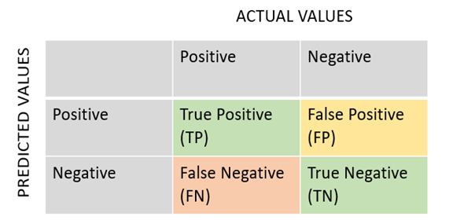
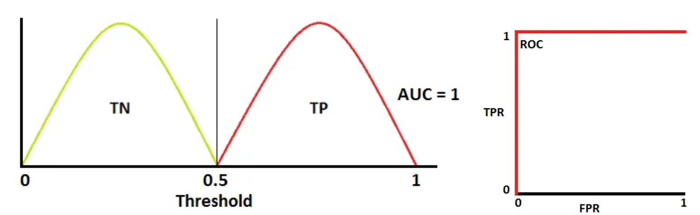
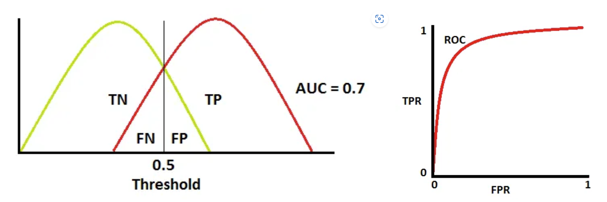
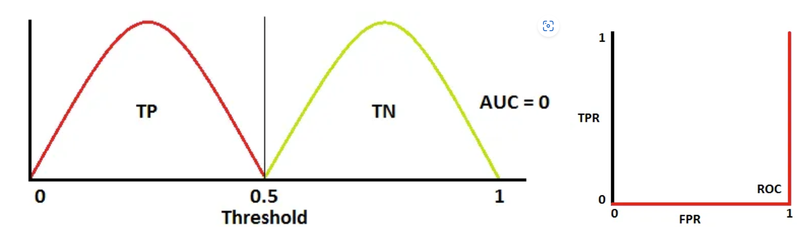
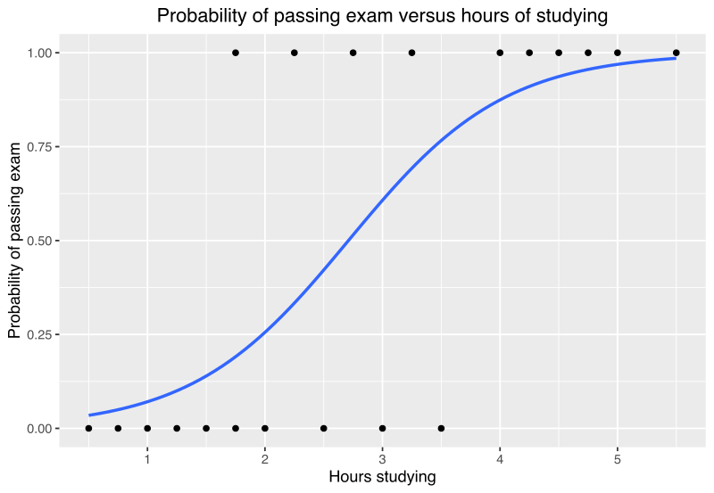
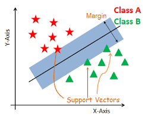
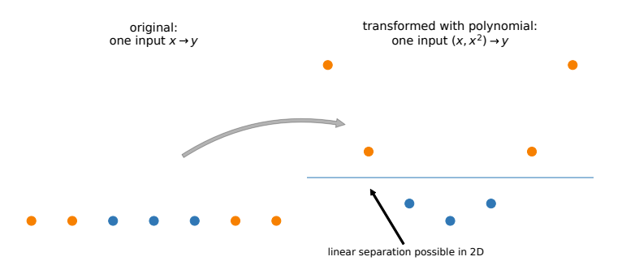

# Classification techniques
There are two types of problems in supervised Machine Learning:"
- Regression: the output is a continuous value and represents a **quantity**.
- Classification: the output is a discrete value and represents a **category**.

## Classification metrics
A sample $x$ can be classified as true positive (TP), true negative (TN), false positive (FP) or false negative (FN). 

The table shows a **Confusion Matrix**: the diagonal elements of the matrix represent the number of correct predictions, while the off-diagonal elements represent the number of incorrect predictions. The confusion matrix is a useful tool for evaluating the performance of a classification model and identifying areas for improvement.

- **Error Rate**: The error rate is simply the fraction of wrong observations:

$$\text{Error Rate} = \frac{1}{n} \sum_{i=1}^{n} \begin{cases} 1 & \text{if } y_i \neq \hat{y}_i \\ 0 & \text{otherwise} \end{cases}$$

- **Precision**: measures the proportion of true positives among the total number of predicted positives. It is calculated as $$\text{Precision} = \frac{TP}{TP + FP}$$ where TP is the number of true positives and FP is the number of false positives. Precision is a measure of how accurate the positive predictions are.

- **Recall**: measures the proportion of true positives among the total number of actual positives. It is calculated as $$\text{Recall} = \frac{TP}{TP + FN}$$ where TP is the number of true positives and FN is the number of false negatives. Recall is a measure of how well the model identifies positive instances.

- **Specificity**: measures the proportion of true negatives among the total number of actual negatives. It is calculated as $$\text{Specificity} = \frac{TN}{TN + FP}$$ where TN is the number of true negatives and FP is the number of false positives. Specificity is a measure of how well the model identifies negative instances.

- **F1-score**: is the harmonic mean of precision and recall, and provides a balance between the two metrics. It is calculated as $$\text{F1-score} = 2 \cdot \frac{\text{precision} \cdot \text{recall}}{\text{precision} + \text{recall}}$$ F1-score is a measure of the model's accuracy that takes both precision and recall into account.

#### Example 
These metrics are commonly used in binary classification problems, where the goal is to classify instances into one of two categories. For example, in medical diagnosis, a model might be trained to classify patients as either having a disease or not having a disease based on their symptoms. 

The *precision* metric would measure how accurate the model is at identifying patients with the disease, while the *recall* metric would measure how well the model identifies all patients with the disease. The *specificity* metric would measure how well the model identifies patients who do not have the disease, and the F1-score would provide an overall measure of the model's accuracy.

### ROC Curve
(See Logistic Regression later: ROC curve helps in selecting the correct threshold).

The ROC (Receiver Operating Characteristic) curve is a graphical representation of the performance of a binary classification model. It shows the trade-off between the true positive rate (TPR) and the false positive rate (FPR) for different classification thresholds.

$$ \text{TPR} = \frac{TP}{TP + FN}$$
$$ \text{FPR} = \frac{FP}{FP + TN}$$

The TPR is the proportion of actual positive instances that are correctly identified as positive by the model, while the FPR is the proportion of actual negative instances that are incorrectly identified as positive by the model.

The ROC curve plots the TPR on the y-axis and the FPR on the x-axis, and each point on the curve represents a different classification threshold. A perfect classifier would have a TPR of 1 and an FPR of 0, which would correspond to the top-left corner of the ROC curve. A random classifier would have a diagonal ROC curve from the bottom-left to the top-right corner.

The area under the ROC curve (AUC) is a commonly used metric to evaluate the performance of a binary classification model. A perfect classifier would have an AUC of 1, while a random classifier would have an AUC of 0.5. The closer the AUC is to 1, the better the model's performance is at distinguishing between positive and negative instances.

## Logistic Regression
It is not a regression technique, as the name suggests, but rather a classification method. 

Logistic regression is a classification method that predicts the probability of an instance belonging to a certain class. It uses a logistic function to model the relationship between the input variables and the output class probabilities.

$$p(x) = \frac{e^{\beta_0 + \beta_1 x}}{1 + e^{\beta_0 + \beta_1 x}}$$

Find the best $\beta_0$ and $\beta_1$ that maximize the likelihood of the data.

	

## Support Vector Techniques
A support vector classifier is a type of binary classification algorithm that separates instances into two classes by finding the hyperplane that maximizes the margin between the two classes. The hyperplane is defined by a linear combination of the input variables, and the coefficients of the hyperplane are learned from the training data.

$$\beta_0 + \boldsymbol{\beta} \cdot \mathbf{z}_p = 0$$

Find the best $\beta_0$ and $\boldsymbol{\beta}$ that maximize the margin between the two classes.

### Support Vector Classification
Assumes that the data is linearly separable. If it is not, it will not work well.

### Support Vector Machine
Add the kernel trick to SVM to make it non-linear.
	