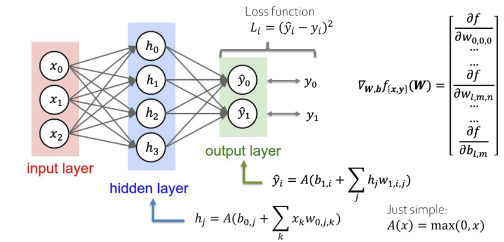
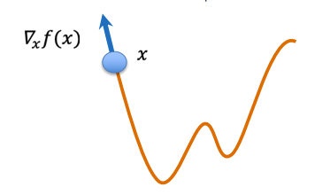
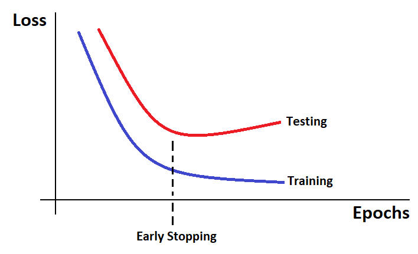

# Neural Networks

## Neural Network
A neural network is a computational graph, i.e. a collection of nodes and edges that perform a computation. 
- Nodes are inputs (outputs).
- Edges are adjustable weights.

## Activation Functions
Introduce nonlinearity in the output. 
- Sigmoid
- Tanh
- ReLU
- Softmax 

## Loss function: measures the error of the network
1. The output of the network $\hat{y}$ is compared to the true value $y$, by using a **loss function**:
$$ \mathcal{L}(\hat{y}, y)$$
This is the loss for one sample; for more samples we compute the average loss: 
$$J(W) = \frac{1}{n} \sum_{i=1}^{n} L(\hat{y}; y_i)$$

Where $W$ is the set pof adjustable weights of the Neural Network. 

The goal is to find $W^*$ such that the error is minimum: 

$$W^* = \operatorname*{argmin}_W J(W)$$

## Gradient Descent: find the weights

Find the minimum stepping down the gradient: 

Use an iterative method: **Gradient Descent**: 

$$W_{n+1} = W_n - \lambda \cdot \nabla_W J(W_n)$$

- $\lambda$: the learning rate, which controls the size of the weight update step in gradient descent
- $\nabla_W J(W_n)$: the gradient of the cost function with respect to the weights
- $W_n$: the current set of weights in the iterative process of gradient descent

### Stochastic Gradient Descent
Do update above for a **single** instance of data:
$$W_{n+1} = W_n - \lambda \cdot \nabla_W \mathcal{L}(\hat{y}_i, y_i)$$

## Backpropagation: how to compute the gradients

The output of the network $\hat{y}$ is a composition of functions:

$$ \hat{y} = a^L(W^L(a^{L−1}(W^{L−1}
(\dots W^1
(x)))))$$

So to calculate the gradient of the loss function $\nabla_W \mathcal{L}(\hat{y}, y)$ we use the chain rule: 
$$\frac{\partial \mathcal{L}}{\partial w_z} \bigg|_{\tilde{x}} = \frac{\partial \mathcal{L}}{\partial a^L} \cdot \frac{\partial a^L}{\partial W^L} \left.\frac{\mathrm{d} \mathcal{W}^L}{\mathrm{~d} a^{L-1}} \cdot \frac{\mathrm{d} a^{L-1}}{\mathrm{~d} \mathcal{W}^{L-1}} \cdot \ldots \frac{\mathrm{d} \mathcal{W}^i}{\mathrm{~d} w_z}\right|_{\vec{x}}$$

## Prevent overfitting
NNs are prone to overfit, due to the high number of parameters that make these models very complex. 

Techniques to avoid overfitting are: 
- Early Stopping: stop training if not improving. 

- Weight Regularization: impose a constraint on weights (e.g. like LASSO loss: $\argmin_w |\hat{y} - y|^2 + |w|_1$
).

- Dropout: remove some neurons during training. 

## Loss functions
- Mean Squared Error (regression problems).
- Cross Entropy Loss (classification problems).

# Pytorch
Pytorch is a Python framework designed for Neural Network training.
Main ingredients of Pytorch scripts are: 
- *Tensors*: are the building block of pytorch. `torch.tensor` (sort of equivalent to numpy arrays).
- *Build a model*: `nn.Module` class.
- *Training loop*: 
    - Calculate loss. 
    - Perform optimizer step.
    - Evaluate model by using a validation set. 
- `Dataset` and `Dataloader`: classes that allow b access and load data respectively. 